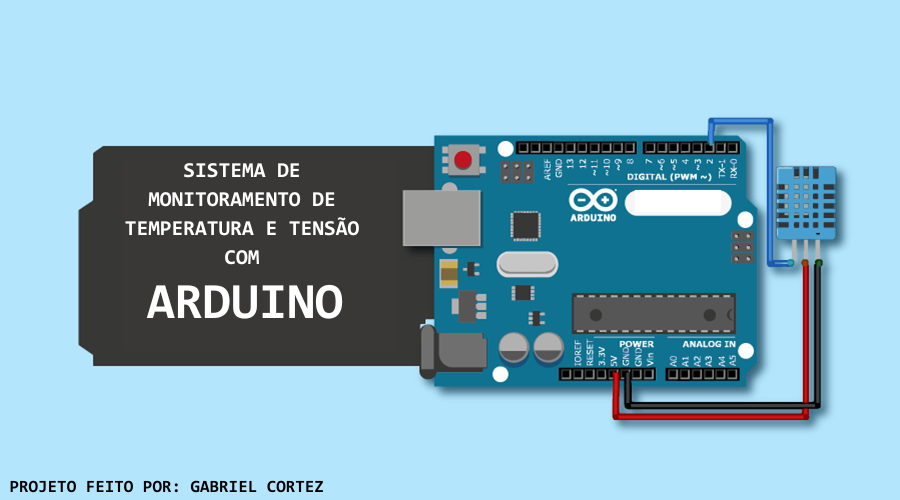

# 📡 Sistema de Monitoramento 💻

## Sistema de monitoramento de Temperatura e Tensão

### Os dados são gerados através de uma placa Arduino, depois os dados lidos e apresentados por uma aplicação desenvolvida em C#

### Requisitos:
- Placa Arduino
- Firmware disponibilizado no repositório
